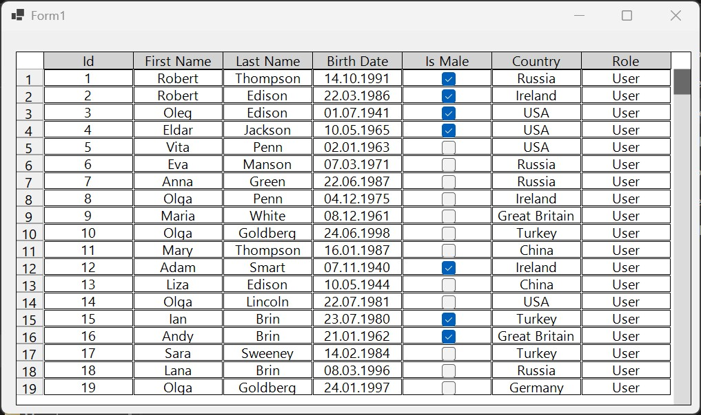

# YDs AwesomeDataGrid



Simple and faster DataGridView without dependencies

- ✅ Just Control-based class with GDI+ rendering, no magic
- ✅ Small sized control without overhead
- ✅ Custom typed and format columns
- ✅ Inline editors (for string, DateTime, Enum, Int32, Float32) via small cached controls + checkboxes for Boolean
- ✅ Image column support
- ✅ Virtualized by default
- ✅ Key inputs (arrows, ESC, Space, Enter, Del, PgDown, PgUp, Ctrl+C/Ctrl+V)
- ✅ Fully custom scrollbars with dragging
- ✅ Resized columns
- ✅ Latest .NET (10) and .NET Framework (4.8.1) support
- ✅ Simple CSV Data provider for easy tables
- ✅ Light, Dark and custom theme support
- ✅ Always free

## What's under developing now (TODOs)

1. Multiselect
2. Export data to file
3. Customization for cells, rows and columns 
4. Public properties and styles for grid customization

## GetStarted

1. Define your data provider with IDataProvider interface
2. Add AwesomeDataGrid to your form
3. Set data provider as grid DataSource property
4. Enjoy

### Starts with custom data

1. Create data class

```csharp
public class Person
{
    public int Id { get; set; }
    public Bitmap Avatar { get; set; }
    public string FirstName { get; set; }
    public string LastName { get; set; }
    public DateTime BirthDate { get; set; }
    public bool IsMale { get; set; }
    public string Country { get; set; }
    public PersonRoles Role { get; set; }

    public Person(int id, Bitmap avatar, string firstName, string lastName, DateTime birthDate, bool isMale, string country, PersonRoles role)
    {
        this.Id = id;
        this.Avatar = avatar;
        this.FirstName = firstName;
        this.LastName = lastName;
        this.BirthDate = birthDate;
        this.IsMale = isMale;
        this.Country = country;
        this.Role = role;
    }
}
```

2. Create custom data provider like this example

```csharp
public class PersonDataProvider : IDataProvider
{
    public event Action OnDataChanged;

    private Person[] _data;

    public PersonDataProvider()
    {
        // just example!
        _data = PersonGenerator.GetPersons(250).ToArray();
    }

    public object GetData(int row, int column)
    {
        return column switch
        {
            0 => _data[row].Id,
            1 => _data[row].Avatar,
            2 => _data[row].FirstName,
            3 => _data[row].LastName,
            4 => _data[row].BirthDate,
            5 => _data[row].IsMale,
            6 => _data[row].Country,
            7 => _data[row].Role,
            _ => throw new ArgumentOutOfRangeException(nameof(column), "Invalid column index"),
        };
    }

    public void SetData(int row, int column, object value)
    {
        object _ = column switch
        {
            0 => _data[row].Id = (int)value,
            1 => _data[row].Avatar = (Bitmap)value,
            2 => _data[row].FirstName = (string)value,
            3 => _data[row].LastName = (string)value,
            4 => _data[row].BirthDate = (DateTime)value,
            5 => _data[row].IsMale = (bool)value,
            6 => _data[row].Country = (string)value,
            7 => _data[row].Role = (PersonRoles)value,
            _ => throw new ArgumentOutOfRangeException(nameof(column), "Invalid column index"),
        };
    }

    public IEnumerable<IGridColumn> GetColumns()
    {
        return [
            new IntColumn(nameof(Person.Id), "Id", true, true),
            new ImageColumn(nameof(Person.Avatar), "Avatar"),
            new TextColumn(nameof(Person.FirstName), "First Name", true, true),
            new TextColumn(nameof(Person.LastName), "Last Name", true, true),
            new DateTimeColumn(nameof(Person.BirthDate), "Birth Date", true, true),
            new CheckBoxColumn(nameof(Person.IsMale), "Is Male", true, true),
            new TextColumn(nameof(Person.Country), "Country", true, true),
            new ComboBoxColumn<PersonRoles>(nameof(Person.Role), "Role", true, true),
        ];
    }

    public int RowCount => _data.Length;

    public void SortColumn(string dataPropertyName, ADGSortingDirection sortingDirection)
    {
        if (sortingDirection == ADGSortingDirection.None)
            return;
        else if (sortingDirection == ADGSortingDirection.Ascending)
        {
            _data = dataPropertyName switch
            {
                nameof(Person.Id) => _data.OrderBy(p => p.Id).ToArray(),
                nameof(Person.FirstName) => _data.OrderBy(p => p.FirstName).ToArray(),
                nameof(Person.LastName) => _data.OrderBy(p => p.LastName).ToArray(),
                nameof(Person.BirthDate) => _data.OrderBy(p => p.BirthDate).ToArray(),
                nameof(Person.IsMale) => _data.OrderBy(p => p.IsMale).ToArray(),
                nameof(Person.Country) => _data.OrderBy(p => p.Country).ToArray(),
                nameof(Person.Role) => _data.OrderBy(p => p.Role).ToArray(),
                _ => _data,
            };
        }
        else if (sortingDirection == ADGSortingDirection.Descending)
        {
            _data = dataPropertyName switch
            {
                nameof(Person.Id) => _data.OrderByDescending(p => p.Id).ToArray(),
                nameof(Person.FirstName) => _data.OrderByDescending(p => p.FirstName).ToArray(),
                nameof(Person.LastName) => _data.OrderByDescending(p => p.LastName).ToArray(),
                nameof(Person.BirthDate) => _data.OrderByDescending(p => p.BirthDate).ToArray(),
                nameof(Person.IsMale) => _data.OrderByDescending(p => p.IsMale).ToArray(),
                nameof(Person.Country) => _data.OrderByDescending(p => p.Country).ToArray(),
                nameof(Person.Role) => _data.OrderByDescending(p => p.Role).ToArray(),
                _ => _data,
            };
        }
    }
}
```

3. Set and use data collection in DataProvider property

```csharp
awesomeDataGrid.DataProvider = personDataProvider;
```


### Starts with CSV

```csharp
CsvDataProvider dataProvider = new CsvDataProvider("pathToCsvData.csv");
awesomeDataGrid.DataProvider = dataProvider;
```

Or create your own data provider

---------------------------------------------------------

By @YDav359 aka YD 
